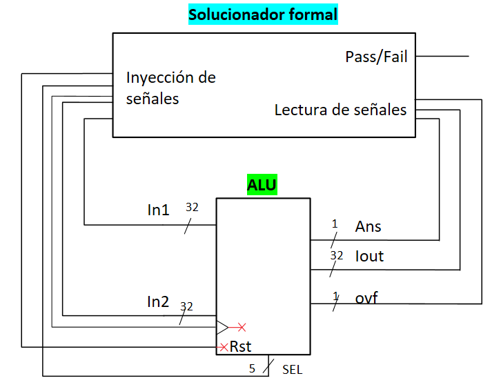

# Verificación formal  de ALU

## Descripción ALU
La ALU es un circuito combinacional el cual por medio de un selector realiza una operación entre dos entradas, estas operaciones pueden ser aritméticas (suma o resta), operaciones bit a bit (xor, or, and), o comparaciones (igual que, mayor que, menor que).

## Diagrama de bloques.

##  Reglas formales.

| Rule                                                                                                                                                                                                                                                                                           | Assume                                    | Assert                                                                                                                                                                                                          |
|------------------------------------------------------------------------------------------------------------------------------------------------------------------------------------------------------------------------------------------------------------------------------------------------|-------------------------------------------|-----------------------------------------------------------------------------------------------------------------------------------------------------------------------------------------------------------------|
| Para un valor de sel = add, y un valor de in2 mayor a `(1.U(33.W) << 32) - in1` (`1.U(33.W)` es un 1 seguido de 32 ceros en binario) el ovf debería ser igual 1.                                                                                                                               | `io.in2 >= ( (1.U(33.W) << 32) - io.in1)` | `io.ovf === 1.U(1.W)`                                                                                                                                                                                           |
| Para un valor de sel = Nop2 la salida debería ser igual a in2.                                                                                                                                                                                                                                 |                                           | `io.out === io.in2`                                                                                                                                                                                             |
| Para un valor de sel = sub, y un valor de in1 mayor a in2 entonces out debería ser menor que in1                                                                                                                                                                                               | `io.in1 > io.in2`                         | `io.out <= io.in1`                                                                                                                                                                                              |
| Para un valor de sel = sll entonces out debería ser igual a `in1 << in2(4,0)`                                                                                                                                                                                                                  |                                           | `io.out === (io.in1 << io.in2(4,0))(31,0)`                                                                                                                                                                      |
| Para un valor de sel = srl entonces out debería ser igual a `in1 >>  in2(4,0)`                                                                                                                                                                                                                 |                                           | `io.out === (io.in1 >> io.in2(4,0))`                                                                                                                                                                            |
| Para un valor de sel = xor, out debería ser igual a in1 xor in2                                                                                                                                                                                                                                |                                           | `io.out === (io.in1 ^ io.in2)`                                                                                                                                                                                  |
| Para un valor de sel = sra, si el bit más significativo de in1 es 1, entonces la salida debería ser igual a `(io.in1 >> io.in2(4,0)) \| (~0.U(32.W) << (32.U - io.in2(4,0)))(31,0)`, si el bit más significativo de in1 es 0, entonces la salida debería ser igual a `(io.in1 >> io.in2(4,0))` |                                           | `when(io.in1(31) === 1.U){ 	verification.assert( io.out === ( (io.in1 >> io.in2(4,0)) \| (~0.U(32.W) << (32.U - io.in2(4,0)))(31,0)) ) }.otherwise{ 	verification.assert( io.out === (io.in1 >> io.in2(4,0)) ) }` |
| Para un valor de sel = nop1, out debería ser igual a in2                                                                                                                                                                                                                                       |                                           | `io.out === io.in1`                                                                                                                                                                                             |
| Para un valor de sel = eq, y asumiendo que in1 es igual a in2, ans debería ser igual a 1, y el bit menos significativo de out debería ser igual a 1                                                                                                                                            |                                           | `io.ans === (io.in1 === io.in2) io.out(0).asBool === (io.in1 === io.in2)`                                                                                                                                       |
| Para un valor de sel = neq, y un valor de in1 diferente de in2, la salida ans debería ser igual a 1.                                                                                                                                                                                           |                                           | `io.ans =/= (io.in1 === io.in2) io.out(0).asBool =/= (io.in1 === io.in2)`                                                                                                                                       |
## Conclusiones
- El Ovf no se da los resultados esperados dado a la manera como se calcula, ya que se realiza una suma entre las dos entradas (in1,in2) que son de 32 bits por lo cual el bit de overflow se pierde, para solucionar este problema remplazar el valor de totalsum por `totalsum := Cat(0.U(1.W), io.in1) + Cat(0.U(1.W), io.in2)`.
- La operación Nop2 no funciona correctamente debido a que muestra en la salida a in1 y debería mostrar la in2. 
- Se escogió un depth de 100 para mas seguridad ya que la verificación no tomaba mucho tiempo en completarse.

## Referecias

- https://github.com/Computer-Architecture-I-UIS/formal-workshop-team_jose
- https://en.wikipedia.org/wiki/Arithmetic_shift
- https://github.com/Computer-Architecture-I-UIS/formal-workshop-maryteam